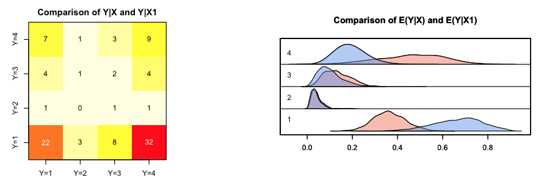

<!-- README.md is generated from README.Rmd. Please edit that file -->
ZeligChoice
===========

<a href="http://zeligproject.org"></a>

[](https://travis-ci.org/IQSS/ZeligChoice) [](https://codecov.io/gh/IQSS/ZeligChoice)

**ZeligChoice** is a module with additional models for the [Zelig](https://github.com/IQSS/Zelig) statistical package in R.

Project page and publications available at: <http://zeligproject.org>



Use
---

Please see the [Zelig Quickstart Guide](https://github.com/IQSS/Zelig/blob/master/README.md) for information on the Zelig Workflow.

Installation
------------

You can install ZeligChoice from CRAN or from GitHub with:

``` r
# install.packages("devtools")
devtools::install_github("IQSS/ZeligChoice")
```
